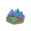
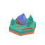
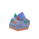
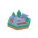
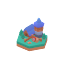
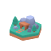
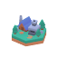
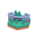
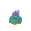

# Daedalus

[English](#english) | [中文](#中文)

---

## English

Daedalus is an agentic 3D world-building platform for immersive Web3 spaces. It turns natural-language briefs into structured scene plans, renders them as browser-based 3D environments, and shows the full workflow from planning to validation and export.

It is designed as a real product surface rather than a single demo page:

- `Home` presents the brand, value proposition, and a live 3D hero scene
- `Studio` lets users enter prompts, watch the workflow progress, and inspect the generated 3D world

### Demo Link
https://daedalus-henna.vercel.app

### What Daedalus does

- Converts product, event, community, and virtual-space briefs into structured 3D scene specs
- Renders stylized 3D environments directly in the browser with Three.js
- Exposes an observable agent workflow with planning, validation, repair, and export states
- Supports controllable prefab landmarks placed by natural language, such as castles, villages, windmills, docks, towers, and wizard towers
- Exports scene specs, execution traces, validation reports, and presentation-ready artifacts

### Product experience

#### Home

- Large 3D background scene integrated into the hero section
- Brand, slogan, metrics, and entry points into the creation flow
- Workflow section explaining how the agent interprets, plans, validates, repairs, and delivers a world

#### Studio

- Prompt input for generating or updating a world
- Live workflow panel showing the current planning step
- Real-time 3D preview of the generated environment
- Validation and artifact panels for inspecting structured outputs

### World system

Daedalus uses a controlled scene schema instead of generating arbitrary frontend code. The model produces structured world data, and the renderer turns that data into a stable visual environment.

Current scene capabilities include:

- Zone-based world layout
- Style presets such as `game`, `animation`, and `voxel`
- Landmark placement by semantic region
- Hex-tile terrain composition
- Seeded terrain profiles: `coastal`, `forest`, `mountain`, `river`, `plain`, and `mixed`
- Prefab-based scene rendering

### Controllable Models

These landmark models can be placed with natural-language instructions such as:

- `Add a small castle on the east side`
- `在东北角增加一个风车`
- `在南边放一个水车和一个码头`

Supported controllable models:

| Preview | Model | Name | Example keywords |
| --- | --- | --- | --- |
|  | `building-castle` | Small Castle | `small castle`, `castle`, `小城堡`, `城堡` |
|  | `building-village` | Village | `village`, `村庄`, `村落` |
|  | `building-house` | House | `house`, `home`, `民居`, `房子` |
|  | `building-cabin` | Cabin | `cabin`, `hut`, `木屋`, `小木屋` |
|  | `building-market` | Market | `market`, `bazaar`, `集市`, `市场` |
|  | `building-archery` | Archery Range | `archery`, `archery range`, `箭术营地`, `射箭场` |
|  | `building-farm` | Farm | `farm`, `farmland`, `农场`, `田地` |
|  | `building-sheep` | Sheep Farm | `sheep farm`, `牧场`, `羊圈` |
|  | `building-mine` | Mine | `mine`, `quarry`, `矿场`, `矿井` |
|  | `building-smelter` | Smelter | `smelter`, `forge`, `冶炼厂`, `熔炉` |
|  | `building-tower` | Watch Tower | `tower`, `watch tower`, `哨塔`, `塔楼` |
|  | `building-wall` | Wall Segment | `wall segment`, `城墙段`, `单段城墙` |
|  | `building-walls` | Fortified Walls | `walls`, `fortified walls`, `城墙群`, `防御城墙` |
|  | `building-dock` | Dock | `dock`, `pier`, `码头`, `栈桥` |
|  | `building-port` | Port | `port`, `harbor`, `港口`, `海港` |
|  | `bridge` | Bridge | `bridge`, `wooden bridge`, `桥`, `桥梁` |
|  | `building-mill` | Windmill (Animated) | `windmill`, `风车` |
|  | `building-watermill` | Watermill (Animated) | `watermill`, `水车` |
|  | `building-wizard-tower` | Wizard Tower | `wizard tower`, `magic tower`, `魔法塔` |

Notes:

- Natural-language placement already supports directions such as `east`, `west`, `north`, `south`, `northeast`, `left top`, `东侧`, `南边`, `左上角`
- Animated assets currently include `building-mill` and `building-watermill`
- Terrain profiles change the overall map character, and regional terrain directives now support phrases such as `south water`, `west forest`, and `northeast mountains`
- Landmark-aware terrain patches keep water-facing, mountain-facing, and settlement assets visually grounded
- `bridge` and every `building-*` controllable landmark is embedded as a native hex tile, so its own base replaces the terrain tile underneath instead of being stacked on top of it

### Prompt template

You can paste and edit this prompt in Studio:

```text
Create a 3D world for an AI x Web3 Demo Day.

The world should feel like a playable hex-map scene, clear enough for browser-based exploration and presentation.

Core zones:
1. A main stage for keynote talks and demos
2. A project booth area for teams
3. A sponsor zone
4. An NFT proof wall
5. A timeline corridor
6. A wallet badge area

Terrain layout:
1. Add a water area on the south side
2. Make the west side a forest
3. Make the northeast side mountainous
4. Keep the center readable and walkable

Landmarks:
1. Add a small castle on the north side
2. Add a windmill in the northeast corner
3. Add a watermill and a dock on the south side near the water
4. Add a port on the southeast side
5. Add a bridge near the timeline corridor
6. Add a village and a market on the west side
7. Add a mine, a smelter, and a wizard tower in the mountain area
8. Add a farm, a sheep farm, a house, a cabin, an archery range, a watch tower, wall segments, and fortified walls where they fit naturally

Use a game style, keep the scene visually coherent, and show that the agent is turning natural language into a structured 3D world.
```

Effective editable parts:

- Terrain phrases such as `south water`, `west forest`, `northeast mountains`, `coastal`, `river`, `plain`, or `mixed`
- Direction phrases such as `north`, `south`, `east`, `west`, `northeast`, `southwest`, `left top`, or Chinese directions like `南边`, `东北角`
- Landmark names listed in the controllable model table
- Style words such as `game`, `animation`, or `voxel`

### Tech stack

- React
- TypeScript
- Vite
- Three.js
- React Three Fiber
- Drei
- Zod

### Local development

```bash
npm install
npm run dev
```

### Environment

Create a `.env` file if you want to enable a live planning provider:

```bash
VITE_GLM_API_KEY=your_key_here
VITE_GLM_BASE_URL=https://api.z.ai/api/paas/v4
VITE_GLM_MODEL=glm-5.1
```
or other planning providers:

Example:

```bash
VITE_DEEPSEEK_API_KEY=your_key_here
VITE_DEEPSEEK_BASE_URL=https://api.deepseek.com
VITE_DEEPSEEK_MODEL=deepseek-chat
```

The current architecture keeps the provider layer isolated, so it can be adapted to other OpenAI-compatible or GLM-compatible endpoints.

When deployed behind the server proxy, the frontend does not need to send a concrete `model` name. The backend injects the active model from server environment variables, which keeps provider selection decoupled from the UI.

### Project structure

```text
src/
  agent/        planner, validation, workflow, provider abstraction
  world/        scene schema, layout, renderer, prefab composition
  components/   UI building blocks
  assets/       static front-end assets
docs/
  PRD.md        product definition and interaction design
```

### Current focus

Daedalus is being built as a practical platform for:

- immersive product showcases
- Web3 community spaces
- virtual demo environments
- browser-based world prototyping

### License

No license file has been added yet.

---

## 中文

Daedalus 是一个面向沉浸式 Web3 空间的 Agent 式 3D 世界生成平台。它可以把自然语言需求转换为结构化场景方案，在浏览器中渲染为 3D 环境，并完整展示从规划、验证到导出的工作流。

它不是单一的演示页，而是一个完整的平台形态：

- `Home` 用来展示品牌、产品价值和首屏 3D 场景
- `Studio` 用来输入提示词、观察工作流，并查看生成出的 3D 世界

### Demo Link
https://daedalus-henna.vercel.app

### Daedalus 能做什么

- 将产品空间、活动空间、社区空间、虚拟展示空间需求转换为结构化 3D 场景规范
- 基于 Three.js 在浏览器中直接渲染风格化 3D 世界
- 展示可观察的 Agent 工作流，包括规划、验证、修复和导出
- 支持通过自然语言放置可控 prefab 资产，例如城堡、村庄、码头、风车、水车、哨塔、魔法塔
- 导出 scene spec、执行轨迹、验证报告和演示材料

### 产品体验

#### Home 页面

- 首屏以大型 3D 场景作为背景
- 展示品牌、slogan、关键数字和进入创作流程的入口
- 通过工作流模块说明系统如何理解需求、规划空间、验证结构、修复问题并交付结果

#### Studio 页面

- 输入提示词并生成或更新世界
- 通过实时工作流面板查看当前执行阶段
- 在 3D 预览区查看生成结果
- 在验证区和产物区检查结构化输出

### 世界生成系统

Daedalus 采用受控 scene schema，而不是让模型直接生成任意前端代码。模型负责输出结构化世界数据，渲染器负责把这些数据转成稳定、可展示的 3D 场景。

当前支持的能力包括：

- 基于 zone 的世界布局
- `game`、`animation`、`voxel` 等风格预设
- 基于语义区域的地标放置
- 六边形地块地形拼装
- 基于 seed 的地形档位：`coastal`、`forest`、`mountain`、`river`、`plain`、`mixed`
- 基于 prefab 的场景渲染

### 可控模型

下面这些 landmark 模型已经支持通过自然语言进行有效放置，例如：

- `在东侧增加一个小城堡`
- `在东北角增加一个风车`
- `在南边放一个水车和一个码头`

当前支持的可控模型如下：

| 预览 | 模型名 | 中文名 | 可生效关键词示例 |
| --- | --- | --- | --- |
|  | `building-castle` | 小城堡 | `小城堡`、`城堡`、`castle` |
|  | `building-village` | 村庄 | `村庄`、`村落`、`village` |
|  | `building-house` | 民居 | `民居`、`房子`、`house` |
|  | `building-cabin` | 木屋 | `木屋`、`小木屋`、`cabin` |
|  | `building-market` | 集市 | `集市`、`市场`、`market` |
|  | `building-archery` | 箭术营地 | `箭术营地`、`射箭场`、`archery` |
|  | `building-farm` | 农场 | `农场`、`田地`、`farm` |
|  | `building-sheep` | 牧场 | `牧场`、`羊圈`、`sheep farm` |
|  | `building-mine` | 矿场 | `矿场`、`矿井`、`mine` |
|  | `building-smelter` | 冶炼厂 | `冶炼厂`、`熔炉`、`smelter` |
|  | `building-tower` | 哨塔 | `哨塔`、`塔楼`、`tower` |
|  | `building-wall` | 城墙段 | `城墙段`、`单段城墙`、`wall segment` |
|  | `building-walls` | 城墙群 | `城墙群`、`防御城墙`、`walls` |
|  | `building-dock` | 码头 | `码头`、`栈桥`、`dock` |
|  | `building-port` | 港口 | `港口`、`海港`、`port` |
|  | `bridge` | 桥梁 | `桥`、`桥梁`、`bridge` |
|  | `building-mill` | 风车（带动画） | `风车`、`windmill` |
|  | `building-watermill` | 水车（带动画） | `水车`、`watermill` |
|  | `building-wizard-tower` | 魔法塔 | `魔法塔`、`magic tower`、`wizard tower` |

说明：

- 当前已经支持区域语义，如 `东侧`、`西侧`、`北侧`、`南边`、`东北角`、`左上角`
- 当前带动画的资产是 `building-mill` 和 `building-watermill`
- 当前地形档位会改变整体地图气质，并且区域地形指令已支持 `南边增加一片水域`、`西侧森林`、`东北侧山区` 这类表达
- 地标周边会自动做地形适配，例如水车/码头靠近水域，矿场/魔法塔靠近山石，村庄/农场保持可行走草地
- `bridge` 和所有 `building-*` 可控地标都会作为原生六边形地图格嵌入，模型自带底盘会替代下方地形格，而不是叠加在地形格上

### 示例提示词

请生成一个用于 AI x Web3 Demo Day 的 3D 展示世界。

这个世界需要适合浏览器内浏览和演示，整体要清晰、可读、有未来感，并且带有游戏地图式的空间组织感。

请包含以下核心区域：
1. 一个主舞台，用于团队路演和最终展示
2. 一个项目展区，用于展示多个参赛项目
3. 一个赞助商区域 sponsor zone
4. 一个 NFT 证明墙 nft proof wall
5. 一条时间长廊 timeline corridor，用来展示从构思、开发、验证到提交的过程
6. 一个钱包身份展示区域 wallet badge

请生成以下地形：
1. 南边增加一片水域
2. 西侧生成森林
3. 东北侧生成山区
4. 中心区域保持清晰、可走、适合展示

另外请增加以下地标：
1. 在北侧增加一个小城堡
2. 在东北角增加一个风车
3. 在南边靠近水域的位置增加一个水车和一个码头
4. 在东南侧增加一个港口
5. 在 timeline corridor 附近增加一个桥梁
6. 在西侧增加一个村庄和一个集市
7. 在东北侧山区增加一个矿场、一个冶炼厂和一个魔法塔
8. 在合适的位置增加农场、牧场、民居、木屋、箭术营地、哨塔、城墙段和城墙群

请强调“AI Agent 正在把自然语言需求转成 3D 世界”的感觉，并保证它适合在浏览器中演示。

可修改并且会生效的部分：

- 地形：`南边增加一片水域`、`西侧森林`、`东北侧山区`、`海边`、`河流`、`平原`、`mixed`
- 方位：`北侧`、`南边`、`东侧`、`西侧`、`东北角`、`西南角`、`左上角`、`右下角`
- 地标：上方表格里的所有模型名和关键词，例如 `小城堡`、`村庄`、`码头`、`港口`、`桥梁`、`风车`、`水车`、`魔法塔`
- 风格：`game`、`animation`、`voxel`

### 技术栈

- React
- TypeScript
- Vite
- Three.js
- React Three Fiber
- Drei
- Zod

### 本地运行

```bash
npm install
npm run dev
```

### 环境变量

如果你希望启用在线规划模型，可以创建 `.env` 文件并配置：

```bash
VITE_GLM_API_KEY=your_key_here
VITE_GLM_BASE_URL=https://api.z.ai/api/paas/v4
VITE_GLM_MODEL=glm-5.1
```
或者其他模型提供商:

例如:

```bash
VITE_DEEPSEEK_API_KEY=your_key_here
VITE_DEEPSEEK_BASE_URL=https://api.deepseek.com
VITE_DEEPSEEK_MODEL=deepseek-chat
```

当前架构已经将 provider 层隔离，因此后续可以切换到其他 OpenAI 兼容接口，或接入 GLM 兼容接口。

当使用服务端代理部署时，前端不需要传具体的 `model` 名称；后端会从服务端环境变量中注入当前使用的模型，这样前端界面和底层模型选择就是解耦的。

### 项目结构

```text
src/
  agent/        规划、验证、工作流、模型提供方抽象
  world/        场景 schema、布局、渲染器、prefab 组合
  components/   UI 组件
  assets/       前端静态资源
docs/
  PRD.md        产品定义与交互设计
```

### 当前定位

Daedalus 正在被构建为一个真正可用的平台，适合以下场景：

- 沉浸式产品展示
- Web3 社区空间
- 虚拟活动场景
- 浏览器内 3D 世界快速原型

### License

当前仓库还没有添加正式许可证文件。
